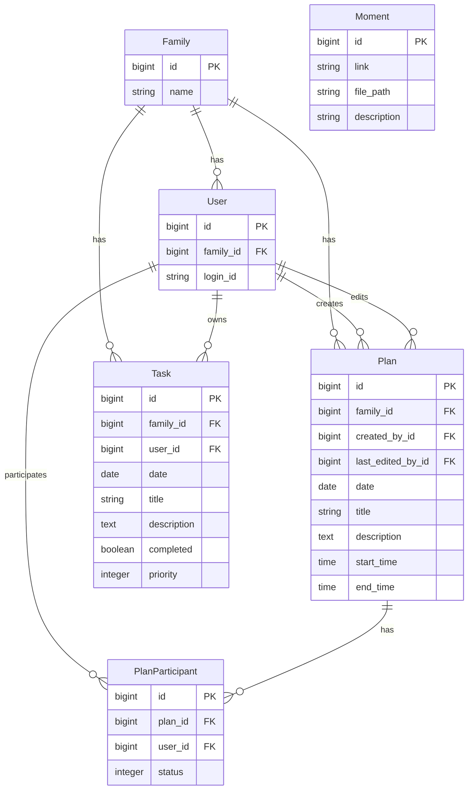

# CastMe 外部仕様書

## 概要
CastMe は、個人およびファミリー向けのスケジュール管理・タスク管理 Web アプリケーションです。
カレンダーベースのUIで予定とタスクを一元管理し、家族間での共有・協力が可能です。

---

## 認証

### ログイン (POST /users/sign_in)
| 項目 | 仕様 |
|------|------|
| 認証方式 | セッションベース (Devise) |
| 入力項目 | `login_id`, `password` |
| セッションタイムアウト | あり (timeoutable) |

### ログアウト (DELETE /users/sign_out)
セッションを終了しルートページにリダイレクト。

---

## カレンダー機能

### Family カレンダー (GET /calendar)
| 項目 | 仕様 |
|------|------|
| 表示対象 | 同一ファミリーの全メンバーの予定・タスク |
| レイアウト | ユーザーごとにセクション分け |
| 操作 | 家族メンバーの参加ステータス変更可能 |

### My カレンダー (GET /calendar/my)
| 項目 | 仕様 |
|------|------|
| 表示対象 | ログインユーザー自身が参加者の予定・タスクのみ |
| レイアウト | シンプルなリスト表示 |

### 日別詳細ビュー (GET /calendar/daily_view)
| パラメータ | 説明 |
|-----------|------|
| `date` | 対象日 (YYYY-MM-DD形式) |
| `scope` | `my` または `family` |
| `user_id` | フィルタリング対象ユーザーID (familyスコープ時) |

---

## 予定 (Plans) 管理

### 一覧 (GET /plans)
| パラメータ | 説明 |
|-----------|------|
| `date` | 対象日 (省略時: 全件) |

### 新規作成 (POST /plans)
| フィールド | 型 | 必須 | 説明 |
|-----------|-----|------|------|
| `title` | string | ✓ | 予定タイトル (最大255文字) |
| `description` | text | - | 詳細説明 (最大1000文字) |
| `date` | date | ✓ | 予定日 |
| `start_time` | time | - | 開始時刻 |
| `end_time` | time | - | 終了時刻 (開始時刻より後) |
| `participant_ids` | array | - | 参加者のユーザーID配列 |

**バリデーション**
- `end_time` は `start_time` より後である必要があります

### 詳細 (GET /plans/:id)
予定の詳細情報と参加者リストを表示。

### 編集 (PUT/PATCH /plans/:id)
作成時と同様のフィールドを更新可能。`last_edited_by` が自動記録されます。

### 削除 (DELETE /plans/:id)
予定を削除。関連する `plan_participants` も削除されます。

---

## 予定参加者 (Plan Participants)

### ステータス更新 (PATCH /plan_participants/:id)
| パラメータ | 値 | 説明 |
|-----------|-----|------|
| `status` | `pending` (0) | 保留中 |
| | `joined` (1) | 参加 |
| | `declined` (2) | 不参加 |

**ファミリービュー時の動作**: 家族メンバーは互いの参加ステータスを変更可能

---

## タスク (Tasks) 管理

### 一覧 (GET /tasks)
| パラメータ | 説明 |
|-----------|------|
| `date` | 対象日 |

### 新規作成 (POST /tasks)
| フィールド | 型 | 必須 | 説明 |
|-----------|-----|------|------|
| `title` | string | ✓ | タスクタイトル (最大255文字) |
| `description` | text | - | 詳細説明 (最大1000文字) |
| `date` | date | ✓ | 期限日 |
| `priority` | integer | - | 優先度 (0-3) |
| `user_id` | integer | ✓ | 担当ユーザーID |

**優先度の値**
| 値 | 表示 | スタイル |
|----|------|---------|
| 0 | 低 | グレー |
| 1 | 中 | 青 |
| 2 | 高 | オレンジ |
| 3 | 緊急 | 赤 |

### 詳細 (GET /tasks/:id)
タスクの詳細情報を表示。

### 編集 (PUT/PATCH /tasks/:id)
作成時と同様のフィールドを更新可能。

### 削除 (DELETE /tasks/:id)
タスクを削除。

### 完了トグル (PATCH /tasks/:id/toggle)
タスクの完了状態を切り替え。Turbo Streamで該当アイテムのみ更新。

---

## モーメント (Moments)

### 一覧 (GET /moments)
保存されたモーメント（リンク/メモ）を表示。

### 新規作成 (POST /moments)
| フィールド | 型 | 必須 | 説明 |
|-----------|-----|------|------|
| `link` | string | ✓ | URL |
| `file_path` | string | - | ファイルパス |
| `description` | string | - | 説明 |

### 編集 (PUT/PATCH /moments/:id)
モーメント情報の更新。

### 削除 (DELETE /moments/:id)
モーメントを削除。

---

## データモデル関係図

---

## UI コンポーネント

### レイアウト
| デバイス | ナビゲーション |
|---------|--------------|
| デスクトップ | サイドバー |
| モバイル | ボトムナビゲーションバー |

### サイドパネル
- 予定・タスクの追加/編集フォームを表示
- Turbo Frameによる非同期更新
- 保存/キャンセルでパネルを閉じる

### カレンダーグリッド
- 月表示（日曜始まり）
- 日付クリックで詳細ビューを更新
- 予定のある日にインジケーター表示

---

## ヘルスチェック

### エンドポイント (GET /up)
| 項目 | 仕様 |
|------|------|
| 用途 | Kamalデプロイ時のヘルスチェック |
| レスポンス | 200 OK (正常時) |

---

## 技術仕様

| 項目 | 技術 |
|------|------|
| フレームワーク | Ruby on Rails 7.0 |
| フロントエンド | Hotwire (Turbo + Stimulus) |
| テンプレート | Slim |
| スタイリング | Tailwind CSS + DaisyUI |
| JavaScript | TypeScript (esbuild) |
| データベース | SQLite |
| 認証 | Devise |
